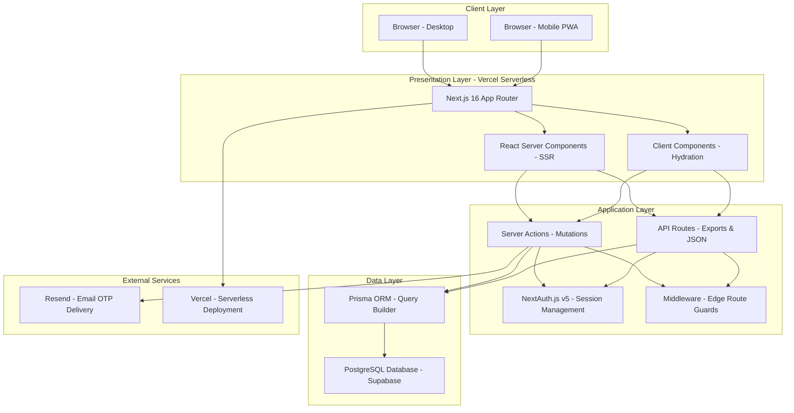
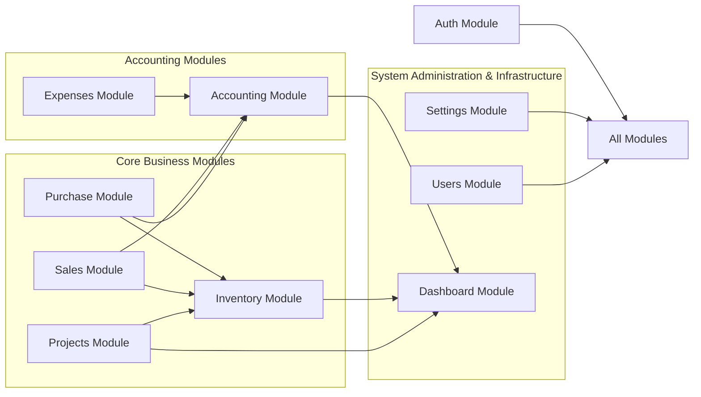
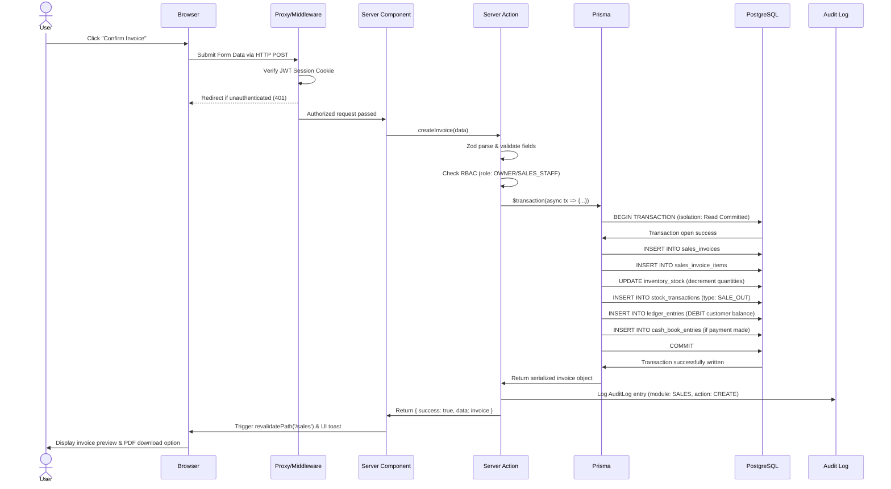
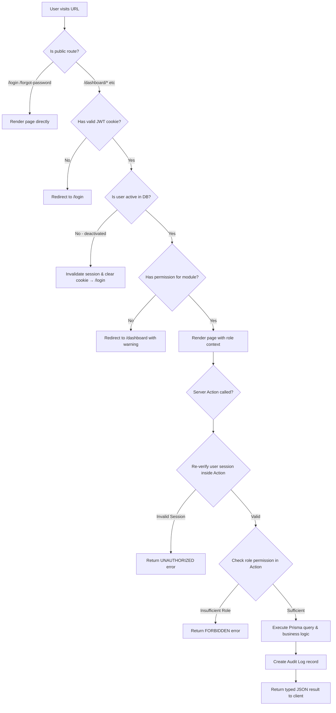

# System Architecture Document — NextGen Interior & Waterproofing ERP

## SECTION 1: Executive Summary

NextGen Interior And Waterproofing ERP is a custom-engineered enterprise resource planning platform designed specifically for the complex operational workflows of the construction material distribution, project management, and specialized waterproofing service industries in Nepal. Managing the unique pricing demands, project-based supply tracks, and tight cash flow characteristics of construction supplies requires a dedicated system that unifies procurement, stock tracking, customer accounts, and standard double-entry bookkeeping into a single, high-performance web dashboard. 

The primary users of the system include the business owner (who requires bird's-eye views of project margins, company assets, and overall trading summaries), purchase managers (responsible for tracking supplier bulk shipments and warehouse stock receptions), sales staff (who draft retail or wholesale invoices and process customer credit notes/payments), and project supervisors (who monitor material supply sheets and coordinate project billings). By providing tailored user roles (from viewer to superadmin) and context-aware interfaces, the system ensures that non-technical field workers can log material distributions easily, while managers retain strict audit controls over the company accounts.

From a technology standpoint, the system is built on Next.js 16 (utilizing the App Router paradigm), TypeScript, Prisma ORM, and PostgreSQL. Next.js was chosen to support a hybrid model of fast, secure React Server Components (RSCs) for read-heavy administrative reporting, combined with dynamic Client Components for real-time interactive forms. Prisma and PostgreSQL ensure strict relational integrity and transaction-safe modifications, which are absolutely crucial for financial double-entry ledgers. By hosting the data on Supabase and deploying the server layer on Vercel, the platform achieves extremely low latency, automated backups, and institutional-grade transport security.

---

## SECTION 2: High-Level Architecture

The platform follows a modern, highly decoupled N-tier application structure. By using React Server Components, database requests are completed directly on Vercel's edge/server tier, eliminating client-to-API round-trips for initial page renders.



### Architectural Layer Responsibilities:

- **Client Layer**: A fully responsive web interface that acts as a progressive web application (PWA). It handles local states, form validation feedbacks, dynamic UI adjustments, and local print operations.
- **Presentation Layer**: Governed by the Next.js 16 App Router, this layer utilizes React Server Components for highly optimized, zero-bundle-size server-side rendering (SSR), and Client Components for dynamic client-side hydration (such as search boxes, modals, and charts).
- **Application Layer**: Houses the core business logic. Next.js **Server Actions** act as type-safe RPC endpoints for data mutations, while **API Routes** handle file-based exports (Excel reports, PDF streaming) and specific JSON lookups. **Middleware** provides an Edge-optimized session guard to prevent unauthenticated access to system routes.
- **Data Layer**: Prisma ORM maps database schemas to strict TypeScript types, coordinates multi-table transactional logic, and prevents SQL injection using parameterized statements. PostgreSQL serves as the relational database engine, executing transactional procedures under ACID constraints.
- **External Services**: Resend manages reliable transactional email dispatching for user password reset requests (OTP), while Vercel coordinates hosting, certificate renewals, and automatic edge deployment routing.

---

## SECTION 3: Module Architecture

The codebase is organized into 10 high-level modules residing within `/src/modules`. Each module enforces strict boundary concerns, managing its own schemas, server actions, and type definitions.



### Module Descriptions & Dependencies:

1. **Auth Module (`auth`)**: Owns user authentication, secure sessions, and OTP generation. It secures all other modules by injecting current user identities into actions and API requests.
2. **Dashboard Module (`dashboard`)**: Owns home screen analytics, quick widget summaries, and recent transaction panels. It depends on `sales`, `purchase`, `projects`, and `accounting` to construct financial graphs.
3. **Users Module (`users`)**: Owns user database directories, role management (RBAC), and user profile states. It acts as an administration utility across all modules.
4. **Settings Module (`settings`)**: Owns business profile metadata (PAN, business name, address, contact), default tax rates, and invoice themes. Its data is used globally by document builders.
5. **Inventory Module (`inventory`)**: Owns master product directories, brands, categories, stock adjustments, and multi-warehouse balances. It is queried during purchase reception, sales checkout, and project material releases.
6. **Purchase Module (`purchase`)**: Owns supplier profiles, purchase orders (PO), partial shipment receptions, and purchase invoice tracking. It depends on `inventory` for products and writes to `accounting` to record credit balances.
7. **Sales Module (`sales`)**: Owns customer profiles, sales invoices (Retail, Wholesale, and Project), payments, credit notes, and sales returns. It queries `inventory` for pricing and stock availability, and posts automatically to `accounting`.
8. **Projects Module (`projects`)**: Owns project contracts, material issue sheets, and project-specific invoice triggers. It depends on `sales` for client billing and `inventory` for material cost tracking.
9. **Accounting Module (`accounting`)**: Owns customer and supplier ledgers, the general cash book, fixed asset registers, and depreciation records. It acts as the financial receiver for `sales`, `purchase`, and `expenses`.
10. **Expenses Module (`expenses`)**: Owns non-procurement operating expense entries (rent, payroll, utilities) and their payment modes. It posts directly to the Cash Book within `accounting` to record cash outflows.

---

## SECTION 4: Request Lifecycle

To guarantee transactional safety across our business flow, operations such as invoicing trigger atomic updates across inventory, sales, cash book, and accounting ledgers. The sequence diagram below maps the complete path of a typical sales invoice request.



---

## SECTION 5: Authentication & Authorization Flow

The platform relies on NextAuth.js v5 (Auth.js) using JWT tokens to secure all client routing and backend server procedures. Role-based access control (RBAC) checks occur both in the middleware (for UI page accessibility) and deep inside server actions (for business rule security).



---

## SECTION 6: Data Flow — Double-Entry Accounting

Every transaction affecting cash, receivables, payables, or physical stock must maintain zero-sum bookkeeping. When an invoice is processed, or when items are returned, the transaction propagates across five specific sub-systems to maintain mathematical ledger consistency.

```mermaid
flowchart LR
  subgraph "Sales Return Event"
    SR[Sales Return Registered\nINV-0001 / SRN-0001\nTotal: NPR 4,689.50]
  end
  subgraph "Stock Inbound Impact"
    ST[StockTransaction\ntype: RETURN_IN\nqty: +5 bags]
    IS[InventoryStock\nquantity: incremented available]
    ST --> IS
  end
  subgraph "Ledger Credit Bookkeeping"
    LD1[LedgerEntry CREDIT\nParty: Customer\nNPR 4,689.50\nchannel: WHOLESALE]
  end
  subgraph "Cash Outflow Impact"
    CB[CashBookEntry\ntype: PAID (Refunded)\nNPR 4,689.50]
  end
  subgraph "Adjusted Invoice Totals"
    SI[SalesInvoice DB Record\nTotal amount updated\nBalance due updated]
  end
  subgraph "Financial Reports Update"
    PL[P&L Statement\nSales returns deducted]
    BS[Balance Sheet\nOutstanding AR decreased]
    CF[Cash Flow\nRefund outflow recorded]
  end
  SR --> ST
  SR --> LD1
  SR --> CB
  SR --> SI
  LD1 & SI --> PL
  LD1 & SI --> BS
  CB --> CF
```

### The Rule of Immutability:

1. **Audit Trail Integrity**: Standard accounting principles require that financial history cannot be rewritten. Therefore, `LedgerEntry`, `CashBookEntry`, and `StockTransaction` rows are **immutable**. 
2. **Reversal Entries**: If an entry was entered incorrectly, users cannot perform `UPDATE` or `DELETE` commands on these tables. Instead, they must log a **reversal transaction** (such as a return note or credit note) which credits what was previously debited, maintaining a transparent, perfect ledger history for tax and audit purposes.

---

## SECTION 7: Technology Stack Decisions

Our architectural stack has been chosen to optimize development speed, type safety, and real-time computation without compromising financial calculations.

| Technology | Version | Purpose | Why Chosen | Alternative Considered |
|-----------|---------|---------|------------|----------------------|
| **Next.js** | 16.0.0 | Full-stack framework | App Router for native React Server Components, fast server-side reports, and edge-ready API routes. | Vite + Express (rejected due to complex deployment and lack of native server actions). |
| **TypeScript** | 5.0.0+ | Static type safety | Prevents type mismatch errors across invoices, quantities, and roles prior to runtime compilation. | Vanilla JavaScript (rejected due to vulnerability to bugs in financial calculations). |
| **Prisma** | 7.8.0 | Object-Relational Mapper (ORM) | Multi-table database transactions (`$transaction`), auto-generated TypeScript schema types, and automatic seed hooks. | Drizzle ORM (rejected due to raw SQL complexity for complex double-entry accounting). |
| **PostgreSQL** | 16.0 | Primary relational database | Solid relational integrity, support for concurrent transactions, and robust indexing. | MySQL (rejected due to weaker transaction handling and strict constraint limits). |
| **NextAuth.js** | 5.0.0-beta | Authentication engine | Seamless Next.js middleware routing security, JWT token encryption, and native database session adapters. | Auth0 / Clerk (rejected due to external network dependency and pricing plans). |
| **TailwindCSS** | 4.0.0+ | Styling framework | Utility-first approach ensures highly responsive layouts and eliminates heavy stylesheets. | CSS Modules (rejected due to slower prototyping speed and lack of consistent design tokens). |
| **shadcn/ui** | Latest | UI Component library | Accessible, fully styled raw components using Radix UI primitives. | Material UI / Ant Design (rejected due to heavy bundle size and difficult styling overrides). |
| **Zod** | Latest | Runtime schema validation | Dual-purpose: provides client-side form validation feedback and acts as a strict guard at the entrance of Server Actions. | Yup (rejected due to poorer integration with TypeScript type inference). |
| **React PDF** | Latest | PDF generation | Compiles React components directly into binary PDF blobs within Server Actions for reliable downloading. | html2pdf / Puppeteer (rejected due to heavy server resource usage and unstable CSS margins). |
| **xlsx (SheetJS)** | Latest | Excel exports | Direct generation of clean excel files of client ledgers and profit & loss sheets on the server. | CSV-only exports (rejected due to poor business owner experience). |
| **Resend** | Latest | Transactional Email API | Extremely high email delivery rates and simple API key integration for secure OTP delivery. | Custom SMTP server (rejected due to poor IP reputation and high spam delivery rate). |
| **Supabase** | - | Database Hosting & Storage | High availability PostgreSQL instances, automated transaction backups, and visual explorer. | AWS RDS (rejected due to complex pricing and high management overhead). |
| **nepali-date-converter** | Latest | BS/AD Calendar conversions | Converts Gregorian dates to Nepali Bikram Sambat (BS) calendar for local business reporting. | Custom date math (rejected due to high leap-year calculation error risks). |

---

## SECTION 8: Security Architecture

The system implements a multi-layer security defense, focusing on guarding sensitive financial balances and inventory stocks against unauthorized modifications.

1. **Transport Security**: Handled natively by Vercel by enforcing modern TLS 1.3 encryption and HSTS (HTTP Strict Transport Security) header options. This mitigates man-in-the-middle (MitM) eavesdropping attacks.
2. **Session Authentication**: Sessions use highly secure JSON Web Tokens (JWT) signed with a server-only environmental secret key, expiring automatically after 30 days. This protects against session hijacking.
3. **Role-Based Access Control**: Strict role checks occur inside every Server Action. A helper function validates if the current user has the minimum required role (e.g. `OWNER`, `MANAGER`, or `SALES_STAFF`). This prevents privilege escalation.
4. **Input Sanitization**: Every mutation validates its parameters using a Zod schema. If any parameter contains extra fields, type mismatches, or unexpected lengths, the request is immediately rejected. This prevents buffer overflows and form tempering.
5. **SQL Injection Prevention**: Prisma ORM executes parameterized queries for all operations. Raw queries are completely banned from business routines, making SQL injection attacks impossible.
6. **Sensitive Data Hashing**: Passwords are never stored in plain text. They are hashed using `bcrypt` with a work factor of 12 rounds. This mitigates database leak exposure.
7. **OTP Security**: One-Time Passwords generated during recovery are cryptographically hashed in the database, expire strictly after 10 minutes, and are locked after 5 consecutive failed verification attempts to prevent brute-forcing.
8. **Audit Trail**: Every mutation writes to the `AuditLog` table, tracking the user ID, module name, action name, record ID, and exact JSON diffs of `oldValues` and `newValues`. This secures trace integrity in case of employee fraud.
9. **Environment Separation**: Sensitive credentials (such as Supabase connection strings, NextAuth secrets, and Resend keys) are managed inside Vercel's encrypted environment variable vault, never reaching public source repositories.

---

## SECTION 9: Performance Considerations

To keep the application responsive when processing thousands of transaction entries, we have optimized the system using physical indexes, edge-side caching, and asynchronous request queuing.

### 1. Database Indexing Strategy:
We have established target indexes across core tables in `prisma/schema.prisma` to accelerate query execution:
- **`AuditLog`**: Index on `[userId, module]` and `[recordId]` to speed up administrative logs lookups.
- **`StockTransaction`**: Composite index on `[productId, warehouseId, createdAt]` to speed up current stock calculations (which sum transaction balances) and movement reports.
- **`LedgerEntry`**: Index on `[partyType, partyId, entryDate]` to load customer/supplier ledger balances chronologically without full table scans.
- **`SalesInvoice`**: Composite indexes on `[customerId, status]` and `[customerId, invoiceDate]` to quickly show client unpaid cards or sales history.

### 2. Caching Strategy:
- Administrative settings (such as business address, standard tax rates, and default printing colors) are cached with a 60-second Time-To-Live (TTL) using a global server promise. This prevents redundant database calls during high-frequency invoicing.

### 3. Pagination & Debouncing:
- Lists such as sales ledgers and product catalogs are bounded using offset-based pagination (20 entries per page), keeping memory payloads low.
- Search filters on product selections and customer directories use a 300ms debounce buffer on the client-side to prevent keystroke spamming from overloading the server actions.

### 4. Asynchronous & Parallel Fetching:
- **`Promise.all`**: The administrative dashboard loads cards asynchronously, running independent queries (today's sales, monthly revenue, aging balance, stock alerts) in parallel to achieve sub-second load times.

---

## SECTION 10: Known Limitations & Future Roadmap

To facilitate long-term planning, we have honestly documented current structural constraints alongside future feature development vectors.

### Current Limitations:
- **Single-Tenant Core**: The codebase supports only one business deployment. Multi-company consolidation requires spinning up separate servers.
- **No Offline Capabilities**: Being an online serverless system on Vercel, the platform requires an active internet connection. Offline cache sync is not supported.
- **Email OTP Exclusivity**: Account recovery relies entirely on Resend email notifications. Direct SMS OTP is not integrated due to regional telecom cost variances.
- **Free Tier Constraints**: Supabase database storage is limited to 500MB, and Vercel free tier limits monthly bandwidth to 100GB.

### Future Enhancement Roadmap:
- **Multi-Tenant SaaS Extension**: Refactoring the schema to support `Tenant` boundaries, enabling a subscription-based model for multiple shop owners.
- **Barcode & QR Integration**: Adding camera-based barcode scanning inside product registration and checkout forms to accelerate warehouse inventory movements.
- **Nepali Payment Gateways**: Integrating eSewa, Khalti, and Fonepay APIs directly into customer invoice records for instant digital balance clearing.
- **Localization (Devanagari)**: Adding translation keys for full Devanagari script support, making the app easier to use for local store workers.
- **WhatsApp API Integration**: Automating PDF invoice delivery by dispatching a download link directly to the customer's WhatsApp contact after purchase confirmation.
