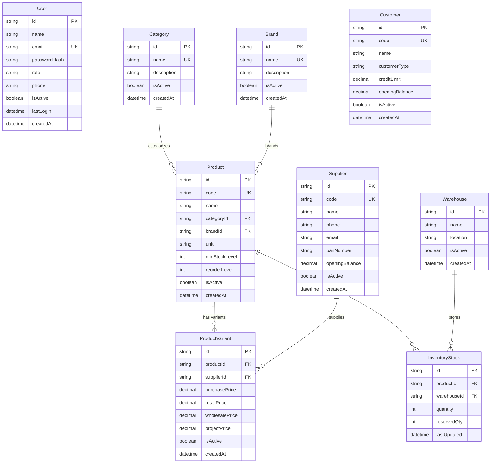
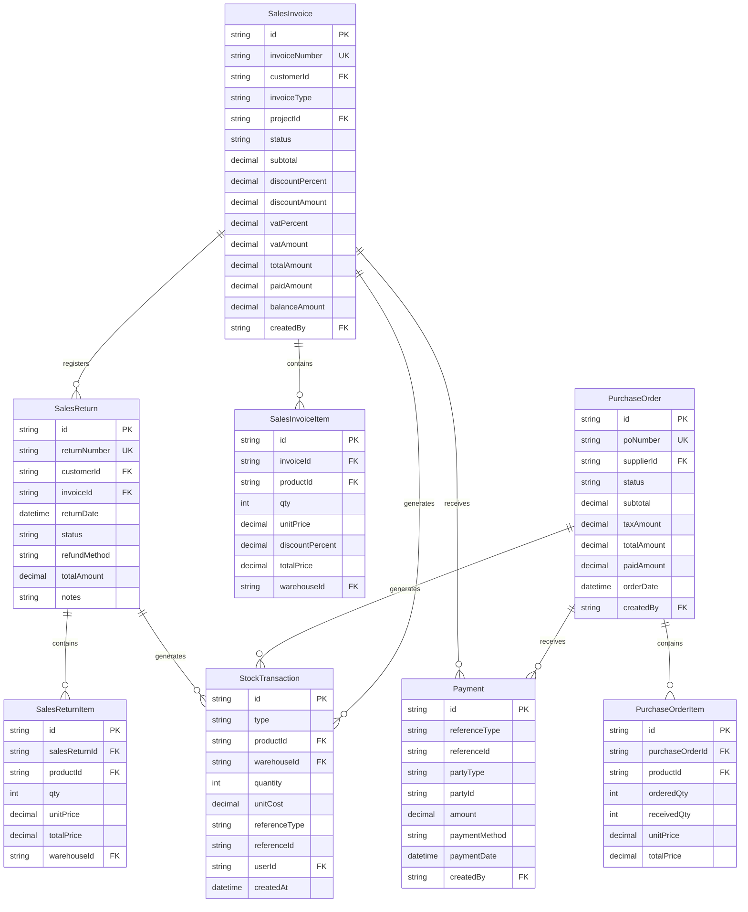
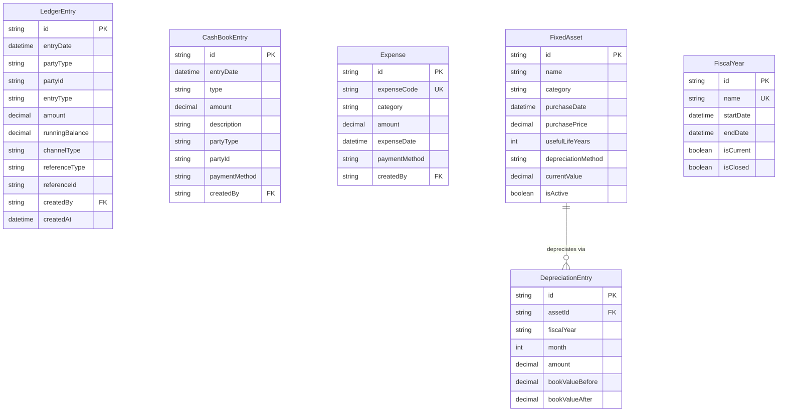
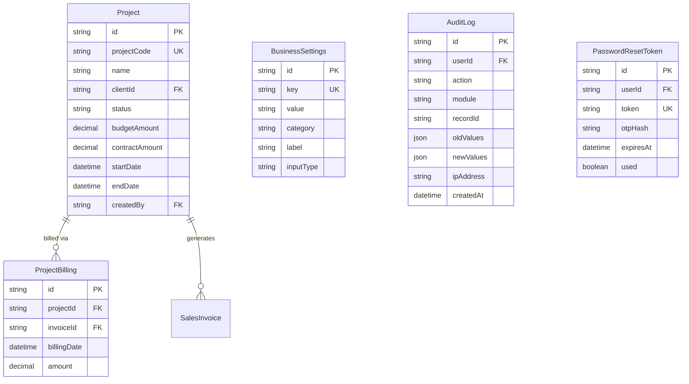

# Database Schema Documentation — NextGen Interior & Waterproofing ERP

## SECTION 1: Database Overview

NextGen Interior And Waterproofing ERP utilizes a robust relational database schema to enforce transactional consistency, zero-sum double-entry accounting integrity, and trace histories of inventory stocks.
- **Total Number of Models**: 30 models mapped in `schema.prisma` (including core master records, project worksheets, procurement items, sales tracking, and complete double-entry ledger entries).
- **Database Engine**: PostgreSQL 16 hosted on Supabase serverless clusters, providing ACID-compliant multi-row transactions and automated physical transaction logging.
- **ORM (Object-Relational Mapper)**: Prisma 7.8.0, compiling native type-safe schema models and auto-generating strict TypeScript definitions.
- **Decimal Precision Safeguard**: Floating-point calculations can introduce tiny round-off errors that compound over large volumes. To prevent this, all financial rates, pricing fields, taxes, and ledger balances are stored using the PostgreSQL `Decimal(14, 2)` or `Decimal(12, 2)` type, mapped directly to decimal calculation libraries (such as `decimal.js`) in the application tier.
- **Soft Deletes**: Master files (such as `Product`, `Customer`, `Supplier`, `Warehouse`, `Category`, `Brand`, and `FixedAsset`) do not allow destructive hard deletes to protect historic reports. Instead, they implement an `isActive` boolean flag to filter out inactive profiles from active dashboard drop-downs.
- **Record Immutability**: All tables storing financial, cash, or stock balances (`LedgerEntry`, `CashBookEntry`, and `StockTransaction`) are strictly **immutable**. They never support `UPDATE` or `DELETE` requests, protecting the business database from untraceable balance manipulations.

---

## SECTION 2: Full ERD — Core Business Models

The ERD below maps the relationships between users, products, suppliers, customers, warehouses, and current inventory levels.

---

## SECTION 3: ERD — Transactions

The ERD below represents purchasing, sales, returns, customer payments, and their stock transactions.

---

## SECTION 4: ERD — Accounting Models

The ERD below covers ledgers, cash flows, operating expenses, asset sheets, and depreciation schedules.

---

## SECTION 5: ERD — Projects & Settings

The ERD below defines operational project tracking, user audit trails, recovery tokens, and business profile metadata.

---

## SECTION 6: Data Dictionary

### 1. `LedgerEntry.entryType`
- **Type**: `Enum ["DEBIT", "CREDIT"]`
- **Purpose**: Establishes whether a financial posting increases or decreases the outstanding receivable/payable balance of the respective customer or supplier.
- **Business Rule**: 
  - For **Customers**: A sales invoice DEBITS their ledger (increasing what they owe). A payment received CREDITS their ledger (decreasing what they owe).
  - For **Suppliers**: A purchase invoice CREDITS their ledger (increasing what we owe them). A payment made DEBITS their ledger (decreasing what we owe them).
- **Example Value**: `"DEBIT"`

### 2. `LedgerEntry.channelType`
- **Type**: `Enum ["RETAIL", "WHOLESALE", "PROJECT", "GENERAL"]`
- **Purpose**: Classifies ledger movements by active sales channel, supporting channel-specific revenue filtering on accounting sheets.
- **Business Rule**: Automatically inherits the `invoiceType` from sales transactions, or defaults to `"GENERAL"` for non-invoice ledger ledger modifications.
- **Example Value**: `"WHOLESALE"`

### 3. `LedgerEntry.runningBalance`
- **Type**: `Decimal(14, 2)`
- **Purpose**: Holds the real-time outstanding balance owed by/to the party after this specific transaction, enabling zero-latency balance sheet loads.
- **Business Rule**: Computed chronologically using the formula: `Previous Running Balance + (DEBIT Amount) - (CREDIT Amount)`.
- **Example Value**: `16161.50`

### 4. `SalesInvoice.invoiceType`
- **Type**: `Enum ["RETAIL", "WHOLESALE", "PROJECT"]`
- **Purpose**: Controls which price-tier (retail, wholesale, or project rates) is pulled from `ProductVariant` during creation and applies distinct billing workflows (e.g. project invoices require a valid `projectId`).
- **Business Rule**: Wholesale invoices require a registered business customer with a valid PAN. Project invoices require a client link.
- **Example Value**: `"PROJECT"`

### 5. `StockTransaction.type`
- **Type**: `Enum ["PURCHASE_IN", "SALE_OUT", "RETURN_IN", "RETURN_OUT", "ADJUSTMENT_IN", "ADJUSTMENT_OUT", "PROJECT_ISSUE", "PROJECT_RETURN"]`
- **Purpose**: Identifies the exact operational trigger that altered inventory stocks.
- **Business Rule**:
  - `PURCHASE_IN`: Fired upon PO shipment receipt.
  - `SALE_OUT`: Fired upon invoice validation.
  - `RETURN_IN`: Fired upon a sales return note.
  - `ADJUSTMENT_IN` / `ADJUSTMENT_OUT`: Fired during physical stock-taking counts.
  - `PROJECT_ISSUE`: Fired when materials are dispatched to a job site.
- **Example Value**: `"RETURN_IN"`

### 6. `User.role`
- **Type**: `Enum ["SUPERADMIN", "OWNER", "MANAGER", "SALES_STAFF", "PURCHASE_STAFF", "VIEWER"]`
- **Purpose**: Defines system-wide role-based access control (RBAC).
- **Business Rule**: Checked at the entry point of all Server Actions. Only `SUPERADMIN` can modify company staff accounts or trigger database danger zone operations.
- **Example Value**: `"SALES_STAFF"`

### 7. `ProductVariant`
- **Purpose**: Resolves supplier-specific purchasing price-points and maintains the three-tier selling price matrix (retail, wholesale, and project) under historical pricing dates.
- **Business Rule**: Ensures multiple variants can link back to a single master product, preventing duplication of item listings.
- **Example Value**: `productId: "itm-cement", supplierId: "sup-maruti", purchasePrice: 720.00, retailPrice: 830.00`

### 8. `InventoryStock`
- **Purpose**: Serves as a direct snapshot of available and reserved product quantities across multiple physical locations (warehouses).
- **Business Rule**: Uniquely indexed by `[productId, warehouseId]`. The available quantity is calculated as `quantity - reservedQty`.
- **Example Value**: `productId: "itm-cement", warehouseId: "wh-main", quantity: 155, reservedQty: 0`

---

## SECTION 7: Immutability Rules

To maintain absolute financial compliance and stock traceability, the platform isolates core ledgers under strict immutability bounds.

### RULE 1 — LedgerEntry & CashBookEntry are IMMUTABLE:
- **Why**: Standard audit compliance (such as IRS / IRD Nepal requirements) mandates that historic accounting entries cannot be deleted or edited. If a transaction is modified (such as processing a return or fixing a billing typo), the original entry must remain unchanged.
- **Enforcement**: Server Actions do not expose any `updateLedgerEntry` or `deleteLedgerEntry` hooks. Corrections must be handled by creating a **Credit Note (Sales Return)** or logging an opposite reversing transaction, maintaining a perfect, chronological transaction trail.

### RULE 2 — StockTransaction is IMMUTABLE:
- **Why**: A company's physical stock level is a historic accumulation of movements. If a stock record was editable, historic inventory valuation reports would become corrupted.
- **Enforcement**: Any correction in quantities is recorded by writing a new transaction row of type `ADJUSTMENT_IN`, `ADJUSTMENT_OUT`, or `RETURN_IN`, preserving every physical stock movement.

---

## SECTION 8: Indexes & Performance

To keep queries fast when thousands of transactions exist, we have optimized the Supabase PostgreSQL database using targeting composite indexes, declared natively in `schema.prisma`.

| Table | Index Fields | Accelerated Queries | Est. Performance Gain |
|-------|--------------|---------------------|----------------------|
| **`User`** | `[email]`, `[role]` | User login lookups and security role verifications. | Very High (Sub-millisecond login checks) |
| **`Product`** | `[isActive]`, `[code]` | Loading the active item selector dropdowns and scanning SKU codes. | High (Instant catalog rendering) |
| **`ProductVariant`** | `[productId, supplierId, isActive]` | Resolving prices for a selected product and supplier. | High (Prevents scans on variants) |
| **`InventoryStock`** | `[productId]`, `[warehouseId]` | Loading per-warehouse stock cards on product sheets. | Very High (Saves full stock scans) |
| **`StockTransaction`** | `[productId, warehouseId, createdAt]` | Aggregating product stock histories and calculating historical counts. | Critical (Speeds up valuation sheets) |
| **`StockTransaction`** | `[referenceType, referenceId]` | Finding all stock movements linked to a specific invoice or return. | High (Instant transaction tracking) |
| **`PurchaseOrder`** | `[supplierId, orderDate]`, `[status]` | Filtering supplier procurement logs or pending deliveries. | Medium (Optimizes manager dashboard) |
| **`SalesInvoice`** | `[customerId, status]`, `[customerId, invoiceDate]` | Instantly loading unpaid customer cards or outstanding balance lists. | Critical (Saves massive invoice table scans) |
| **`SalesInvoiceItem`** | `[invoiceId]`, `[productId]` | Loading itemized invoice details in preview modals. | High (Optimizes PDF generation speed) |
| **`LedgerEntry`** | `[partyType, partyId, entryDate]` | Rendering customer or supplier ledgers chronologically with rolling balances. | Critical (Avoids slow queries on financial statements) |
| **`CashBookEntry`** | `[entryDate]`, `[type]` | Generating cash book reports and computing daily balances. | High (Speeds up cash audits) |

---

## SECTION 9: Nepal-Specific Business Rules

The platform incorporates localized tax, calendar, formatting, and fiscal configurations to comply with Nepal's regulatory landscape.

1. **VAT (Value Added Tax) Enforcement**: The standard VAT rate of 13% is declared. The calculation of tax is configurable via `BusinessSettings`. Invoices support standard itemized taxable and non-taxable categorizations.
2. **Nepali Lakhs Currency Formatting**: Financial numbers are formatted using the Indian/Nepali numbering system (2-2-3 grouping) rather than the standard Western million system:
   - Western: `NPR 1,000,000.00`
   - Nepali: `NPR 10,000,00.00` (mapped to `formatNPR` which formats `10,00,000.00` Lakhs).
3. **Gregorian (AD) & Bikram Sambat (BS) Dates**: All timestamps are written in Gregorian (AD) format inside PostgreSQL to allow standard date math. However, the presentation layer utilizes the `nepali-date-converter` library to render matching Nepali Bikram Sambat (BS) dates on client screens and official invoice printouts.
4. **PAN (Permanent Account Number) Guard**: Customer and supplier profiles support a 9-digit PAN identifier. In wholesale invoice operations, a valid customer PAN is required to complete tax invoice registrations.
5. **Nepali Fiscal Year Cycles**: Financial transactions are bound inside standard Nepali fiscal years starting Shrawan 1 (mid-July) and ending Ashadh 31/32 (mid-July of the following year), represented in the format `2082-83`.
