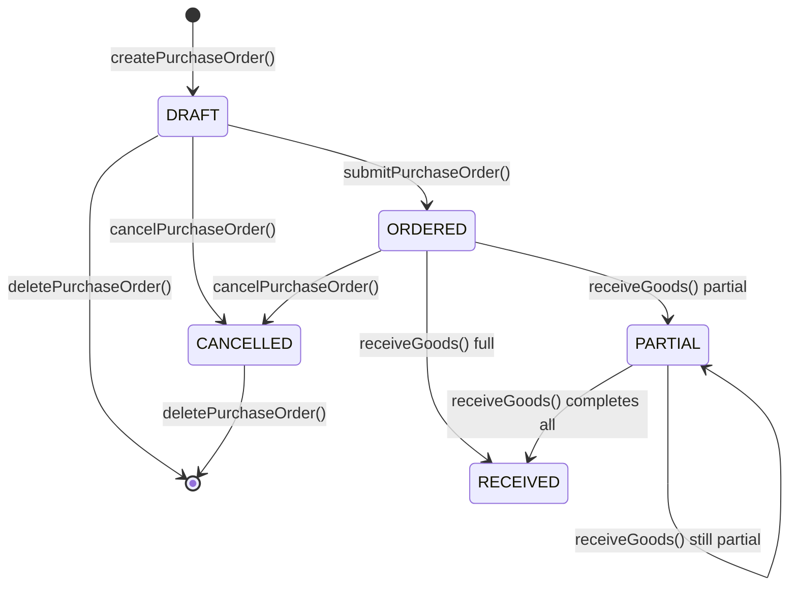
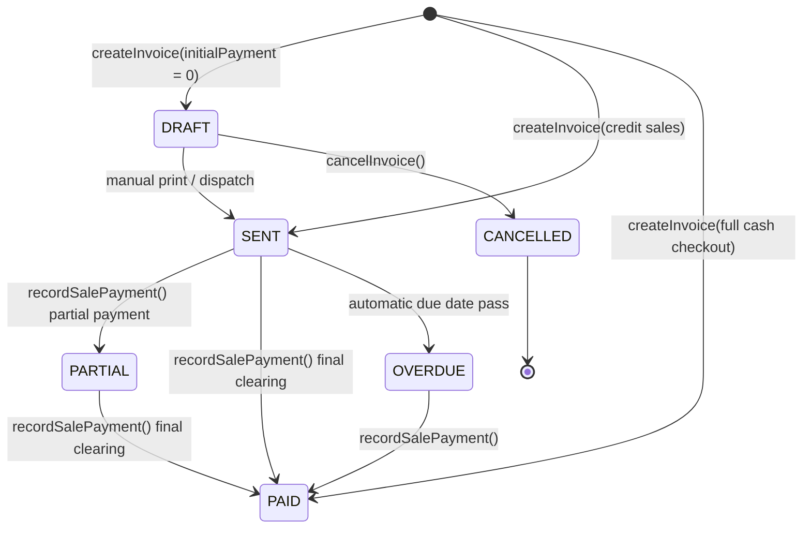
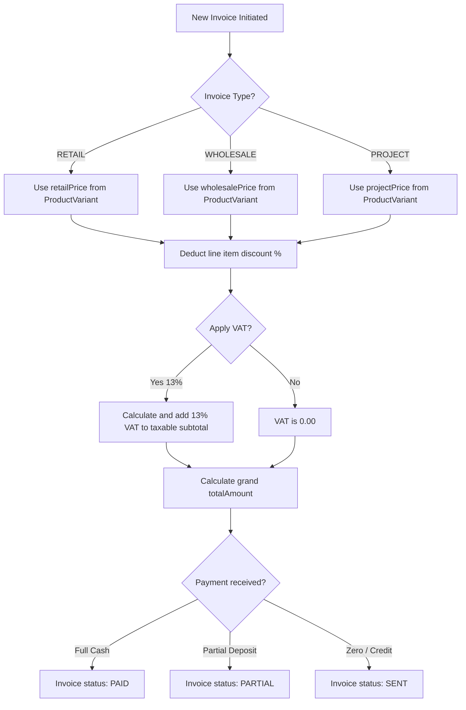
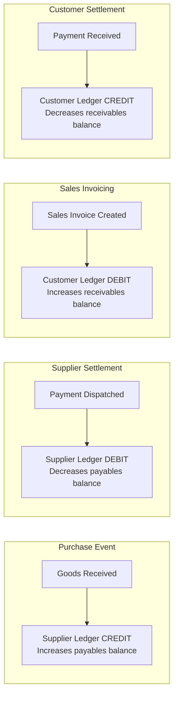
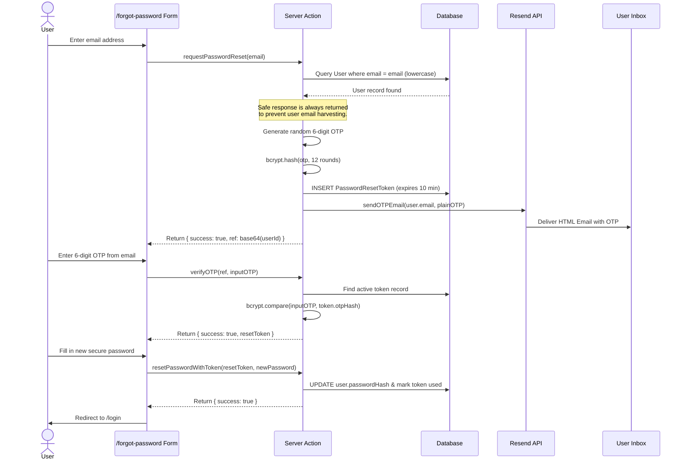
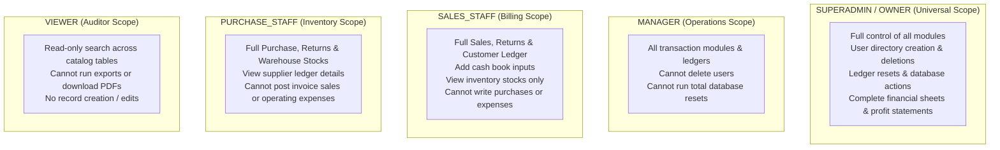

# API and Server Actions Reference — NextGen Interior & Waterproofing ERP

## SECTION 1: API Overview

NextGen Interior And Waterproofing ERP is designed around a hybrid API architecture. The application leverages **Next.js Server Actions** as its primary mutation and remote procedure call (RPC) mechanism, providing direct type-safety between React components and the database. 

Traditional **REST API Routes** are reserved exclusively for file-based streams (such as Excel spreadsheets exports), public/external lookups, and specialized transactional endpoints.
- **Authentication Safeguard**: Every mutation verify-hooks session authentication inside the transaction bounds using NextAuth credentials.
- **Strict Parameter Guards**: Parameter payloads are parsed and validated at runtime using strict Zod schemas, mitigating parameter pollution and injection attacks.

```mermaid
graph LR
  subgraph "Pattern A: Server Actions (Mutations & RPC)"
    CA[Client Component] -->|type-safe call| SA[Server Action]
    SA --> ZV[Zod schema parse]
    ZV --> AU[Session Role Check]
    AU --> DB[(PostgreSQL DB)]
    DB --> RV[revalidatePath/Router refresh]
    RV --> CA
  end

  subgraph "Pattern B: REST API Routes (Data Exports & Feeds)"
    CC[Client Component] -->|HTTP GET/POST| AR[/api/inventory/*]
    AR --> DB2[(PostgreSQL DB)]
    DB2 --> JSON[JSON / Stream StreamResponse]
    JSON --> CC
  end
```

---

## SECTION 2: REST API Routes

### 1. `GET /api/inventory/lookups`
- **Purpose**: Fetches active categories, brands, and warehouses for inventory registration dropdown lists.
- **Authentication**: Yes (Valid session cookie required).
- **Response Format**: `application/json`
- **Success Response (200 OK)**:
  ```json
  {
    "success": true,
    "categories": [{"id": "cat-1", "name": "Cement"}],
    "brands": [{"id": "brd-1", "name": "Maruti"}],
    "warehouses": [{"id": "wh-1", "name": "Main Warehouse"}]
  }
  ```
- **Error Codes**: `401 Unauthorized`

### 2. `POST /api/inventory/create`
- **Purpose**: Programmatic endpoint to register new master products.
- **Authentication**: Yes (Requires roles `SUPERADMIN`, `OWNER`, or `PURCHASE_STAFF`).
- **Request Body**:
  ```json
  {
    "name": "Wall Putty White 40Kg",
    "categoryId": "cat-putty",
    "brandId": "brd-birla",
    "unit": "BAG",
    "minStockLevel": 10,
    "reorderLevel": 15
  }
  ```
- **Success Response (201 Created)**:
  ```json
  {
    "success": true,
    "productId": "itm-putty-40",
    "code": "ITM-0004"
  }
  ```
- **Error Codes**: `401 Unauthorized`, `403 Forbidden`, `400 Bad Request (Validation Schema Failed)`

### 3. `POST /api/inventory/adjust`
- **Purpose**: Adjusts inventory stocks for audit corrections.
- **Authentication**: Yes (Requires roles `SUPERADMIN`, `OWNER`, or `PURCHASE_STAFF`).
- **Request Body**:
  ```json
  {
    "productId": "itm-cement",
    "warehouseId": "wh-main",
    "adjustmentQty": -5,
    "notes": "Damaged during warehouse transit"
  }
  ```
- **Success Response (200 OK)**:
  ```json
  {
    "success": true,
    "stockId": "stk-cement-main",
    "newAvailableQuantity": 150
  }
  ```
- **Error Codes**: `401 Unauthorized`, `403 Forbidden`, `400 Bad Request`

### 4. `GET /api/inventory/export`
- **Purpose**: Streams a dynamically-built Excel worksheet (`.xlsx`) containing a real-time stock valuation report across all active warehouses.
- **Authentication**: Yes (Requires roles `SUPERADMIN`, `OWNER`, `MANAGER`, or `PURCHASE_STAFF`).
- **Query Params**: `?warehouseId=wh-main` (optional).
- **Response Format**: `application/vnd.openxmlformats-officedocument.spreadsheetml.sheet`
- **Error Codes**: `401 Unauthorized`, `403 Forbidden`

---

## SECTION 3: Inventory Server Actions

These actions reside within `src/modules/inventory/actions.ts` and manage master data catalogs and stock adjustments.

### `createInventoryItem(data, userId)`
- **Purpose**: Creates a new product card, establishes variant pricing, and hooks empty stock tracking rows.
- **Authentication**: Requires role `SUPERADMIN`, `OWNER`, or `PURCHASE_STAFF`.
- **Parameters**:
  - `data` (`CreateInventoryItemInput`): Object containing name, unit, minStockLevel, reorderLevel, categoryId, and brandId.
  - `userId` (`string`): ID of the creator.
- **Returns**: `{ success: boolean; data?: Product; error?: string }`
- **Database Operations**: `Prisma.product.create`
- **Side Effects**: Generates unique `ITM-XXXX` prefix code and posts a `CREATE` audit log.
- **Throws When**: Unique constraints on product name or code are violated.

### `adjustInventoryQuantity(stockId, adjustment, userId)`
- **Purpose**: Performs a physical stock correction.
- **Authentication**: Requires role `SUPERADMIN`, `OWNER`, or `PURCHASE_STAFF`.
- **Parameters**:
  - `stockId` (`string`): Target `InventoryStock` record ID.
  - `adjustment` (`number`): Positive or negative quantity offset.
  - `userId` (`string`): ID of the auditing officer.
- **Returns**: `{ success: boolean; data?: InventoryStock; error?: string }`
- **Database Operations**: Multi-row `$transaction` writing:
  - `Prisma.inventoryStock.update` (quantity offset incremented/decremented).
  - `Prisma.stockTransaction.create` (registers `ADJUSTMENT_IN` or `ADJUSTMENT_OUT`).
- **Throws When**: Available quantities would drop below zero.

### `getInventoryAlerts()`
- **Purpose**: Identifies items currently below their registered `minStockLevel`.
- **Authentication**: Requires role `SUPERADMIN`, `OWNER`, `MANAGER`, or `PURCHASE_STAFF`.
- **Returns**: `{ success: boolean; data?: Array<{ id: string; name: string; available: number; minLimit: number }> }`
- **Database Operations**: `Prisma.product.findMany` with custom filters summing stock entries.

---

## SECTION 4: Purchase Server Actions

These actions reside within `src/modules/purchase/actions.ts` and coordinate supplier accounts and stock inbound dispatches.



### `createPurchaseOrder(data, userId)`
- **Purpose**: Creates a draft purchase order.
- **Authentication**: Requires role `SUPERADMIN`, `OWNER`, or `PURCHASE_STAFF`.
- **Parameters**: `data` (`CreatePurchaseOrderInput` schema), `userId` (`string`).
- **Returns**: `{ success: boolean; data?: PurchaseOrder }`
- **Database Operations**: `Prisma.purchaseOrder.create`, `Prisma.purchaseOrderItem.create`.

### `receiveGoods(data, userId)`
- **Purpose**: Receives bulk supply deliveries at a specific warehouse.
- **Authentication**: Requires role `SUPERADMIN`, `OWNER`, or `PURCHASE_STAFF`.
- **Parameters**: `data` containing `purchaseOrderId`, `warehouseId`, and an array of `{ productId, receivedQty }`.
- **Returns**: `{ success: boolean; error?: string }`
- **Database Operations**: Multi-row `$transaction` writing:
  - Increments `orderedOrderItem.receivedQty`.
  - Upserts `inventoryStock` per warehouse.
  - Creates `stockTransaction` of type `PURCHASE_IN`.
  - Auto-updates `purchaseOrder.status` to `RECEIVED` or `PARTIAL`.
- **Throws When**: Received quantity exceeds remaining ordered balance.

### `createPurchaseReturn(data)`
- **Purpose**: Logs defective materials shipped back to suppliers.
- **Returns**: `{ success: boolean; data?: PurchaseReturn }`
- **Side Effects**: Debits supplier balance ledger and decrements warehouse stocks.

---

## SECTION 5: Sales Server Actions

These actions reside within `src/modules/sales/actions.ts` and manage customers, payment registrations, invoicing, and return credits.



### `createInvoice(data, passedUserId)`
- **Purpose**: Commits sales, reserves or decrements stock, issues ledger credit bounds, and triggers double-entry balances.
- **Authentication**: Requires role `SUPERADMIN`, `OWNER`, or `SALES_STAFF`.
- **Parameters**: `data` (`CreateInvoiceInput` schema containing customer, items, invoice type, tax, and optional initial payment).
- **Returns**: serialized `SalesInvoice` object.
- **Database Operations**: Atomic `$transaction` writing to:
  - `salesInvoice` (inserts billing headers)
  - `salesInvoiceItem` (inserts item lists)
  - `inventoryStock` (decrements stock balances)
  - `stockTransaction` (inserts `SALE_OUT` entry)
  - `ledgerEntry` (DEBITS customer ledger account with full invoice value)
  - `payment` & `cashBookEntry` (credits payment if initial deposit made)

### `createSalesReturn(data, userId)`
- **Purpose**: Logs credit note returns for products sent back by clients.
- **Authentication**: Requires role `SUPERADMIN`, `OWNER`, or `SALES_STAFF`.
- **Parameters**: `data` (`CreateReturnInput` schema containing return quantities per item).
- **Returns**: Net adjusted `SalesInvoice` card.
- **Database Operations**: Atomic `$transaction` writing to:
  - `salesReturn` & `salesReturnItem` (creates return credit note)
  - `inventoryStock` (increments available quantities)
  - `stockTransaction` (inserts `RETURN_IN` entry)
  - `ledgerEntry` (posts CREDIT entry to customer balance, decreasing outstanding dues)
  - `cashBookEntry` (posts `PAID` outflow refund entry if cash refund given)
  - `salesInvoice` (updates `totalAmount` and `balanceAmount` to the net adjusted figures)

### Pricing & Tax Calculations Logic:


---

## SECTION 6: Accounting Server Actions

These actions reside within `/src/modules/accounting/` and coordinate bookkeeping records.



### `createFixedAssetAction(data)`
- **Purpose**: Registers high-value company assets (machinery, store vehicles).
- **Authentication**: Requires role `SUPERADMIN` or `OWNER`.
- **Database Operations**: `Prisma.fixedAsset.create`.

### `runDepreciationAction()`
- **Purpose**: Iterates over all active fixed assets and posts monthly depreciation entries based on straight-line or declining balance methods.
- **Authentication**: Requires role `SUPERADMIN` or `OWNER`.
- **Database Operations**: Multi-row `$transaction` updating `currentValue` in `fixedAsset` and creating `depreciationEntry` logs.

---

## SECTION 7: Auth Server Actions

These actions reside within `src/modules/auth/actions.ts` and handle recovery OTP flows.



---

## SECTION 8: RBAC Permission Matrix

System operations are secured based on a vertical hierarchy layout:



### Complete Permission Reference:

| Module | SUPERADMIN | OWNER | MANAGER | SALES | PURCHASE | VIEWER |
|--------|------------|-------|---------|-------|----------|--------|
| **Users Directory** | Full | Full | None | None | None | None |
| **Business Settings** | Full | Full | View | View | View | View |
| **Inventory stock** | Full | Full | Full | View | Full | View |
| **Sales Invoicing** | Full | Full | Full | Full | None | View |
| **Purchase Orders** | Full | Full | Full | None | Full | View |
| **Customer Ledgers** | Full | Full | Full | Full | None | View |
| **Supplier Ledgers** | Full | Full | Full | None | Full | View |
| **Cash Book Entries** | Full | Full | Full | Full | Limited | View |
| **Fixed Assets** | Full | Full | View | None | None | View |
| **Financial Sheets** | Full | Full | Full | Limited | Limited | View |
| **Audit Logs Panel** | Full | Full | None | None | None | None |

---

## SECTION 9: Error Handling Patterns

Every Server Action conforms to a strict unified response structure:

- **Success Standard**: `{ success: true, data: T }`
- **Failure Standard**: `{ success: false, error: string, code: string }`

### Common System Error Codes:

| Error Code | HTTP Equiv | Root Cause | Example Scenario |
|------------|------------|------------|------------------|
| **`UNAUTHORIZED`** | 401 | Missing or expired JWT session. | User calls createInvoice after session has expired. |
| **`FORBIDDEN`** | 403 | Authenticated, but has insufficient role permission. | Sales Staff attempts to edit warehouse settings. |
| **`VALIDATION_ERROR`** | 400 | Zod parsing failed due to input type mismatches. | Quantities sent as text instead of positive integer. |
| **`INSUFFICIENT_STOCK`** | 409 | Inventory available quantity is lower than required. | Attempting to invoice 50 bags when only 5 exist. |
| **`DUPLICATE_CODE`** | 409 | Violation of unique constraints in indexes. | Registering a new product with an existing code. |
| **`NOT_FOUND`** | 444 | Record ID does not exist in databases. | Querying getInvoiceById with a bad UUID string. |
