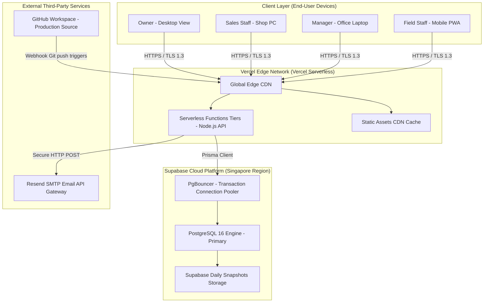

# Operations & Deployment Runbook — NextGen ERP

## SECTION 1: System Overview

NextGen Interior And Waterproofing ERP is a cloud-native platform distributed across fully managed infrastructure tiers to ensure maximum availability, automated scalability, and zero maintenance overhead for the local business staff.

### Production Service Coordinates:
- **Application URL**: `https://nextgen.com.np` (Primary production domain).
- **Presentation & Server Actions Tiers**: Vercel Serverless Hosting Engine.
- **Relational Database**: Supabase PostgreSQL 16 cluster, deployed in the Singapore (`ap-southeast-1`) region to achieve low latency from Nepal.
- **Transactional Mail Gateway**: Resend API, handling automated OTP account recoveries.
- **Source Code Repository**: Hosted on private GitHub workspaces.

### Production Deployment Topology:



---

## SECTION 2: Deployment Pipeline

The codebase enforces a multi-branch deployment flow to protect the live production system from development bugs. We implement three target branches: `develop` (local dev work), `staging` (pre-production testing), and `main` (live environment).

```mermaid
flowchart LR
  subgraph "Developer Sandbox"
    D1[Develop locally on feature branch]
    D2[git push origin develop]
  end
  subgraph "GitHub Actions — CI Pipeline"
    CI1[Lint check & Type check]
    CI2[Test build compilation]
    CI3[CI Status Notification]
  end
  subgraph "Staging Environment (Vercel Staging)"
    S1[Merge develop → staging branch]
    S2[Auto-deploy to preview URL]
    S3[Owner User Acceptance Testing]
  end
  subgraph "Production Environment (Vercel Live)"
    P1[Merge staging → main branch]
    P2[GitHub Actions triggers deploy]
    P3[Vercel builds static pages]
    P4[Prisma DB push migrations run]
    P5[New version live on nextgen.com.np]
  end
  D1 --> D2 --> CI1 --> CI2 --> CI3
  CI3 -->|Passes CI| S1 --> S2 --> S3
  S3 -->|Approved by Owner| P1 --> P2 --> P3 --> P4 --> P5
```



### Detailed Deployment Instructions:

#### 1. Developing a New Feature:
- Developers must create a separate branch off `develop`: `git checkout -b feature/quotations`.
- Run static checks before pushing: `npx tsc --noEmit && npm run build`.
- Push changes: `git push origin feature/quotations` and open a Pull Request (PR) to `develop`.

#### 2. Pre-production Staging Deployment:
- Once merged into `develop` and verified, merge `develop` into `staging`.
- Vercel automatically detects the push and deploys the preview build. 
- The QA team performs Client User Acceptance Testing (UAT) on this staging preview URL.

#### 3. Production Deployment (Main Release):
- Merge the approved `staging` branch into `main`.
- The production runner compiles components, executes Prisma database structure migrations (`npx prisma db push` / `prisma migrate deploy`), and updates live routing on the production CDN.

#### 4. Rolling Back a Bad Release:
- If a critical bug bypasses QA, log into the Vercel Dashboard -> go to **Deployments** -> locate the previous successful deployment card -> click the three dots -> select **Promote to Production**. This rolls back the live server to the previous stable state within 5 seconds without changing the git history.

---

## SECTION 3: Environment Variables Reference

These variables are defined securely inside Vercel's encrypted Settings panel and locally inside `.env.local` (never committed to git).

| Variable Name | Environment | Description & Source | Rotation Frequency |
|---------------|-------------|----------------------|--------------------|
| **`DATABASE_URL`** | Vercel + Local | Supabase -> Settings -> Database. The direct transaction pooler connection string. | Only if credentials are leaked. |
| **`NEXTAUTH_SECRET`** | Vercel + Local | Cryptographic string generated using `openssl rand -base64 32` to sign cookies. | Annually. |
| **`NEXTAUTH_URL`** | Vercel + Local | The canonical live domain URL (e.g. `https://nextgen.com.np`). | If company domain is changed. |
| **`RESEND_API_KEY`** | Vercel + Local | Resend Dashboard -> API Keys. Used to authorize email recovery dispatches. | Only if leaked. |
| **`NEXT_PUBLIC_VAT_RATE`** | Vercel + Local | Holds default standard VAT percentage (`13`). | If Nepal national tax rate changes. |

### Impact of Missing/Wrong Variables:
- **`DATABASE_URL`**: App completely crashes; users see a `500 Server Error` on all dynamic routes.
- **`NEXTAUTH_SECRET`**: Users cannot log in; all password forms fail to generate session cookies.
- **`RESEND_API_KEY`**: Staff account recovery OTP mails fail to send; logs report mail delivery errors.

---

## SECTION 4: Database Backup & Recovery

Because financial accounting requires zero data loss, the backup and disaster recovery runbook must be strictly executed by the systems administrator.

### 4.1 Automatic Cloud Backups (Supabase):
- **Free Tier Configuration**: Supabase executes a full physical snapshot of the database once a day, retaining the backups for **7 days**.
- **Pro Tier Option**: Retains hourly logical snapshots for **30 days** and supports Point-in-Time Recovery (PITR) to restore the database to a specific second.
- **How to Restore**: Go to Supabase Dashboard -> **Database** -> **Backups** -> select the target date and time -> click **Restore Backup**.

### 4.2 Manual Database Backups:
To create a hard copy on your local storage before major upgrades, use our custom shell utilities:
```bash
# 1. Run the built-in backup script (configured in package.json)
npm run backup

# 2. The script executes a pg_dump stream and saves a compressed file to:
# /nextgen-erp/backups/nextgen_erp_YYYY-MM-DD.sql.gz

# 3. To manually restore the database from a backup file:
gunzip -c nextgen_erp_YYYY-MM-DD.sql.gz | psql $DATABASE_URL
```

### 4.3 Mandatory Backup Triggers:
You must trigger a manual backup immediately before:
- Running Prisma schema changes (`npx prisma db push` or schema edits).
- Running database data repair migrations or batch SQL routines.
- Major dependency package updates.

### 4.4 Emergency Disaster Recovery Procedure (Database Corruption):
1. **Detect**: System logs report database errors, or users report total loss of record visibility.
2. **Alert**: Promptly notify Nischal Timsina (Business Owner) of the system downtime.
3. **Isolate**: Place Vercel into **Maintenance Mode** by rerouting traffic to a static page or pausing Vercel serverless functions, blocking incoming data requests.
4. **Inspect**: Open the Supabase Database dashboard to verify project status. If the DB is healthy but data is corrupted, select the most recent automated daily backup.
5. **Restore**: Trigger the database restore procedure from the Supabase Backups dashboard.
6. **Verify**: Run query checks on `SalesInvoice` and `LedgerEntry` tables to ensure cash balances and invoices are complete up to the restore point.
7. **Resume**: Remove the Vercel maintenance block, resume full client routing, and publish an incident wrap-up note.

---

## SECTION 5: Monitoring & Alerting

To maintain a healthy platform, administrators must review service metrics on a regular operational schedule.

### 5.1 Service Metrics Thresholds:

| Metric | Where to Check | Warning Threshold | Operational Remedy |
|--------|----------------|-------------------|--------------------|
| **Application Errors** | Vercel -> Functions -> Logs | Any recurring `500` status codes. | Inspect error traceback for code typos or bad database connection pools. |
| **Database Storage** | Supabase -> Settings | **400MB** (80% of Supabase 500MB free limit). | Upgrade to Supabase Pro Tier or run database storage cleanup routines. |
| **Email Sends** | Resend.com -> Logs | **2,800 emails/month** (near 3,000 free limit). | Upgrade Resend tier to avoid locking staff account recoveries. |
| **Build compilation** | GitHub -> Actions tab | Any red (FAILED) build card. | Review commit log details for TypeScript declaration or build syntax mismatches. |

### 5.2 Common Production Incidents & Quick Fixes:

- **Incident: Login screen returns a "500 Server Error" on password verification.**
  - **Check**: Verify the `NEXTAUTH_SECRET` environment variable in the Vercel settings panel.
  - **Fix**: Re-generate a secure 32-character key, update the Vercel variable value, and trigger a redeployment.
- **Incident: Database Connection Refused or Paused.**
  - **Check**: Free Supabase database instances pause automatically after 7 days of developer inactivity.
  - **Fix**: Go to the Supabase dashboard page and click the green **Unpause Project** button to resume services.
- **Incident: Invoice download prints as a blank page.**
  - **Check**: Vercel Serverless Logs for font compilation errors in `@react-pdf/renderer`.
  - **Fix**: Verify that custom printing fonts are correctly loaded as relative assets during the compilation build stage.

---

## SECTION 6: Upgrading & Maintenance

### 6.1 Running Regular Database Schema Updates:
1. Open and edit `/prisma/schema.prisma` locally.
2. Apply changes to your local development environment: `npx prisma db push`.
3. Verify that the local Next.js compiler runs correctly: `npm run build`.
4. Commit changes: `git add prisma/schema.prisma && git commit -m "feat: add schema fields"`.
5. Upon merging `staging` -> `main`, Vercel's build runner will automatically execute the schema changes using Prisma, preventing runtime table discrepancies.
6. *Caution: Never drop or rename columns containing historical data (e.g. customer balances) without first running a data migration script to preserve balances.*

### 6.2 Annual System Maintenance Checklist:
- **Rotate Credentials**: Renew the `NEXTAUTH_SECRET` and Resend keys to protect data security.
- **Archive Logs**: Move audit logs older than 12 months into historical CSV exports, keeping the database snappy.
- **Initialize Fiscal Year**: Go to **Settings** -> **Fiscal Years** and create the new Shrawan-Ashadh calendar period. Set the new year as `CURRENT` and mark the completed year as `CLOSED`.
- **Review Access Levels**: Clean up deactivated employees and verify active staff roles.
- **Test Backups**: Trigger a manual restore to a local test database to confirm backups are fully functional.

---

## SECTION 7: For the Business Owner (Non-Technical)

As the owner of **NextGen Interior And Waterproofing**, you retain full ownership and control of your system and data.

### 7.1 Support Contact Information:
- **Primary Developer**: Rabin Sharma (Jhapa, Nepal)
- **Email**: `rabinsharma.dev@gmail.com`
- **For Database Support**: Open a ticket at `support.supabase.com`.
- **For Email Delivery Support**: Visit the support section at `resend.com`.

### 7.2 What You Can Manage Without Developer Help:
- **Business Profile details**: Change your firm's name, PAN tax number, phone number, and physical office addresses directly in **Settings** -> **Business Profile**.
- **User management**: Add new employees, assign them roles (e.g. Sales Staff or Viewer), and deactivate accounts immediately if staff leave the company.
- **Data backups**: Access **Settings** -> click **Export Data** to download a compressed database backup anytime.
- **Audit reports**: Check all financial sheets and customer outstanding dues lists.

### 7.3 Understanding Monthly Operating Costs:

The ERP system runs on optimized, free tiers to keep your overhead costs at **zero** during normal operations.

| Service | Monthly Cost | Included Free Limit | Upgrade Indicator |
|---------|--------------|---------------------|-------------------|
| **Vercel** | **NPR 0.00** (Free) | 100GB monthly bandwidth | High site traffic spikes. |
| **Supabase** | **NPR 0.00** (Free) | 500MB database storage | Database approaches **400MB** size. |
| **Resend** | **NPR 0.00** (Free) | 3,000 emails/month | Large team doing hundreds of recovery OTPs. |
| **Domain (.com.np)** | **NPR 0.00** (Free) | Lifetime license | Never (permanent domain registration). |

### 7.4 Data Ownership Guarantee:
Your business database is hosted securely inside the Supabase platform under your official corporate account credentials:
- **Primary Owner Account**: `gauravchaulagain99@gmail.com`
- **Data Export Policy**: You can download all transaction tables, client lists, and bookkeeping logs at any time. Your data belongs strictly to you.
